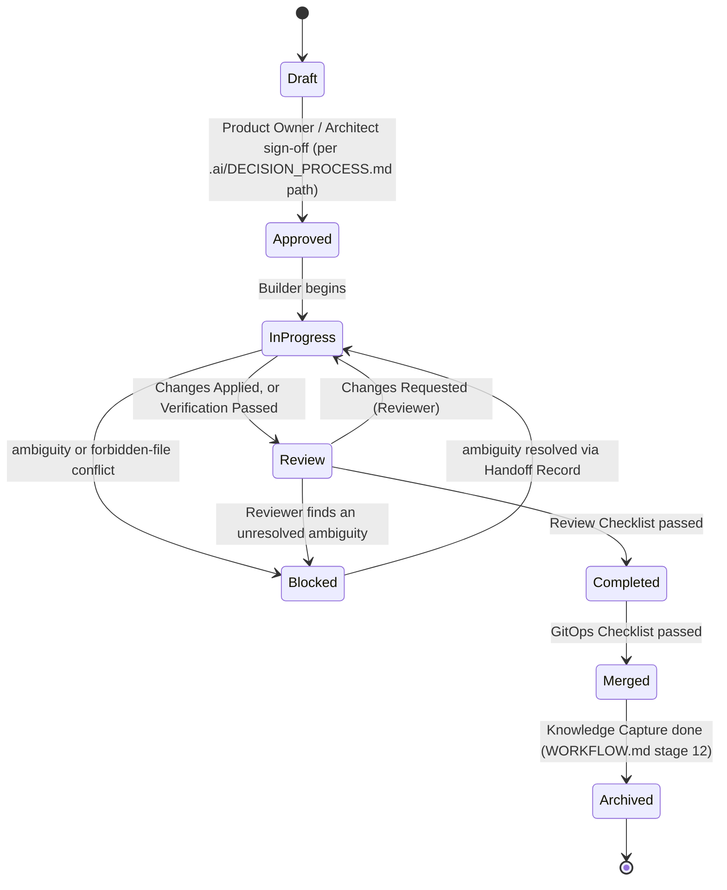

# .orion/missions/ — Mission Framework

## Purpose

No implementation begins without an explicit, bounded execution contract. A Mission is that contract: it tells a Builder exactly what to change, what not to touch, and what "done" means, before a single file is created. This exists because ambiguity at the boundary between an architectural decision and its execution is where both vendor-specific assumptions and scope creep originate.

## What a Mission Is

The execution contract between Product Owner, Chief Architect, Builder, Reviewer, and GitOps for one bounded unit of implementation work. No Builder role may create, modify, or delete a file without an Approved Mission covering it.

## What a Mission Is Not

- Not a replacement for a GitHub Issue — the Issue is *why*; the Mission is *how*, precisely bounded.
- Not a replacement for an ADR — the ADR is the architectural decision; the Mission is what a Builder executes once that decision (if one was needed) has been made.
- Not a place to make new architectural decisions. If executing a Mission reveals that one is needed, stop — see "When a Builder Must Stop" below.

## When a Mission Is Required

Every unit of Builder work, without exception. No implementation begins without an Approved Mission.

## Mission Lifecycle

- **Draft** — being authored, not yet ready for approval.
- **Approved** — Product Owner/Architect (per the applicable governance path in `.ai/DECISION_PROCESS.md`) has signed off; Builder may begin.
- **In Progress** — Builder is actively executing.
- **Review** — Builder has reported a result; Reviewer is evaluating against the Review Checklist.
- **Blocked** — execution cannot continue: ambiguity, missing dependency, or a Forbidden-file conflict was hit.
- **Completed** — Review Checklist passed; Mission is ready for merge.
- **Merged** — GitOps Checklist passed and the change is merged.
- **Archived** — Knowledge Capture (`WORKFLOW.md` stage 12) is done; the Mission is closed and kept for Memory (`WORKFLOW.md` stage 14).

## Standard Execution Results

Every time a Builder or Reviewer acts on a Mission, the result is one of exactly four:

- ✅ **Changes Applied** — work done within the Mission's Authorized Files and Scope; moves to Review.
- ✅ **Verification Passed (No Changes Required)** — the Builder investigated and found the Objective already satisfied; moves to Review with the finding recorded, not invented changes.
- ⚠ **Changes Requested** — Reviewer-only; returns the Mission to In Progress with the specific gap recorded.
- ⛔ **Blocked** — any role hits an ambiguity, missing dependency, or forbidden-file conflict; triggers a Handoff Record.

No other execution result is permitted.

## Rules Every Builder Must Follow Before Creating a File

1. Confirm an Approved Mission exists that names this work. No Mission, no file.
2. Confirm the exact path is covered by the Mission's Authorized Files to Create or Authorized Files to Modify. Not listed means not created.
3. Never touch anything in Forbidden Files, no matter how minor it seems.
4. Never expand Scope or Deliverables unilaterally — a scope gap is a Blocked result, not an invitation to improvise.
5. Never modify governance documents (`.ai/`, `AGENTS.md`, `ORION.md`, `PROTOCOL.md`, `WORKFLOW.md`, `.orion/TEAM.md`, `docs/DECISIONS.md`) under a Mission unless those documents are themselves explicitly authorized by that Mission.
6. Never commit secrets, credentials, tokens, or private keys — the Security Rule already standing in every `.ai/prompts/*.md` file applies unchanged.

## When a Builder Must Stop (Governance Ambiguity)

This extends, and never overrides, the Permanent Rule already defined in `AGENTS.md`: *"If an AI agent encounters ambiguity, missing governance, undefined ownership, or conflicting instructions, the agent must stop, document the ambiguity, and request clarification from the human owner. Agents must never invent governance."*

Applied to Missions, stop and file a Handoff Record (`.ai/HANDOFF_TEMPLATE.md`) immediately if:

- No Approved Mission covers the requested work.
- A file that seems necessary is not authorized by the Mission.
- Acceptance Criteria assume a repository state that does not match reality.
- Two governing documents give contradictory instructions.
- Completing the Mission as written would require touching a file the Mission forbids.

## Relationship to GitHub Issues and ADRs

- **GitHub Issue** — the approved *why*, per `CONTRIBUTING.md`. Where one exists, a Mission references it.
- **ADR** (`docs/DECISIONS.md`) — the architectural *how*, when the work is cross-cutting or hard to reverse. A Mission references one whenever its origin required one.
- **Mission** — the execution *how*. Never originates an architectural decision; if one is needed mid-execution, the Mission is Blocked and the decision is routed through the Architecture or Governance path in `.ai/DECISION_PROCESS.md`.

## Relationship to the AI Board

No Board seats are added or changed. `.ai/BOARD.md` and `.ai/ROLES.md` remain authoritative. Every Mission's Ownership, Review Owner, and Merge Owner fields name an **abstract role** — resolved to the current Board member through [`.orion/TEAM.md`](../TEAM.md), never named directly as a requirement of the framework itself (individual Missions may record the resolved names under Ownership for traceability, as `.orion/TEAM.md` maps them at the time).

## Integration Summary

| Existing document | What changes |
|---|---|
| [`.ai/DECISION_PROCESS.md`](../../.ai/DECISION_PROCESS.md) | Implementation path gains one required step: "Mission approved," between "Issue approved" and Builder execution. |
| [`ORION.md`](../../ORION.md) | Gains one principle under Vendor-Independent Concepts: implementation never begins without a bounded execution contract. |
| [`PROTOCOL.md`](../../PROTOCOL.md) | Gains "Mission" as an artifact type in the Artifacts table. |
| [`WORKFLOW.md`](../../WORKFLOW.md) | Stage 5 exit criteria and Stage 6 inputs both gain "Approved Mission." |
| [`.orion/TEAM.md`](../TEAM.md) | No structural change. |
| [`.github/PULL_REQUEST_TEMPLATE.md`](../../.github/PULL_REQUEST_TEMPLATE.md) | Gains a line requiring the Mission ID and GitOps Checklist confirmation. |

## Mission Log

| Mission ID | Title | Status | Owner | Issue | ADR |
|---|---|---|---|---|---|
| MISSION-0001 | Implement ORION Mission Framework | In Progress | Architecture (Claude Code) | None | [ADR-0005](../../docs/DECISIONS.md) |
