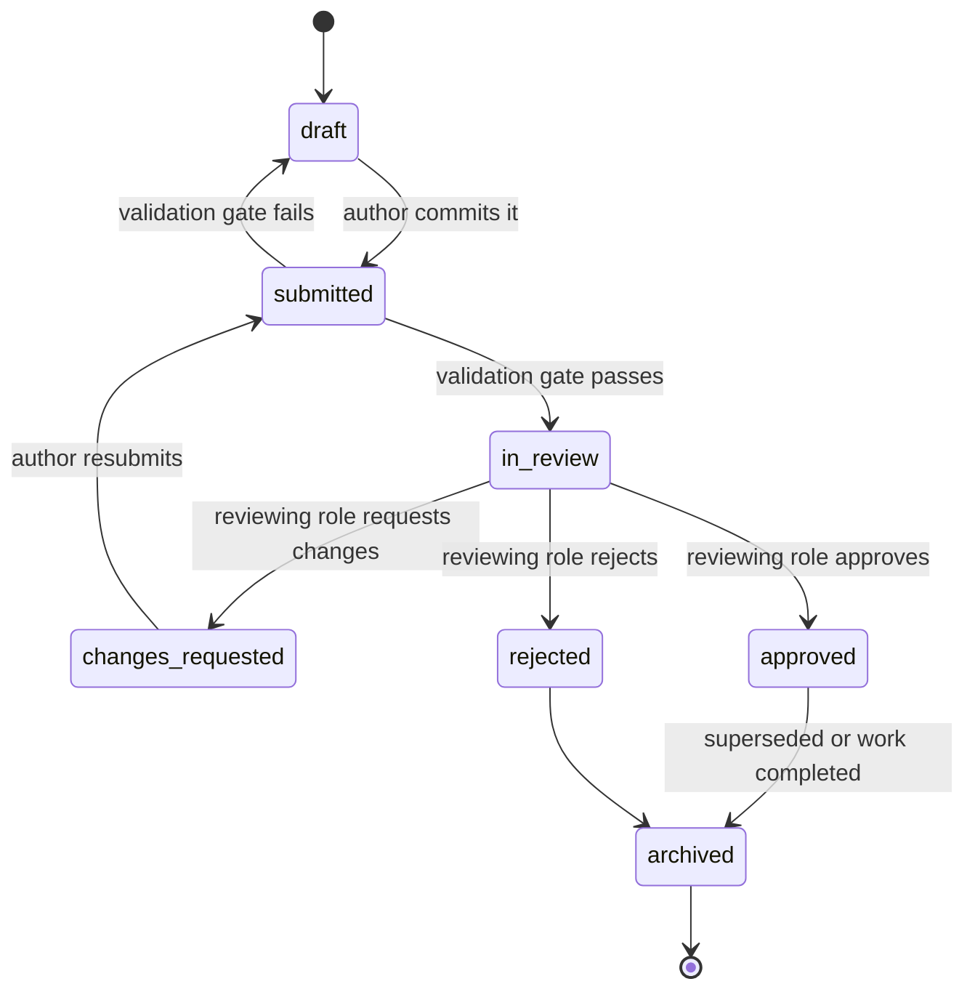

# PROTOCOL.md — Inter-Agent Communication Protocol

| Field | Value |
|---|---|
| Document type | Governance |
| Status | Active |
| Version | 1.0.0 |
| Owner | Board |
| Derives authority from | `ORION.md`, `ROLES.md` |

## Core rule

Agents do not converse. Agents exchange **documents**. A document is the only unit of communication that has standing in ORION OS: if a request, decision, question, or answer did not take the form of a document committed to the repository, it did not happen and cannot be relied upon by any role.

This exists to make coordination between any number of agents — human or AI, present or future, of any vendor — work the same way regardless of how those agents were built. A document does not care what produced it.

---

## 1. Document types

| Document | Raised by | Addressed to | Purpose |
|---|---|---|---|
| **Work Request (WR)** | Any role | Product Owner | Propose an idea, defect, or need for the roadmap |
| **Design Document (DD)** | Architect | Reviewer, Builder | Propose how a roadmap item will be built |
| **Architecture Decision Record (ADR)** | Architect | Board (if ratification required) | Record a cross-cutting or hard-to-reverse decision |
| **Implementation Report (IR)** | Builder | Reviewer | Accompany a Pull Request; states what was built and how it maps to the DD/ADR |
| **Review Report (RR)** | Reviewer | Builder, GitOps | Approve, request changes, or reject an Implementation Report |
| **Test Report (TR)** | Builder or Reviewer | Reviewer, GitOps | Evidence that automated and, where applicable, manual tests were executed and their results |
| **Research Report (ResR)** | Research Agent | Requesting role | Findings, sources, and open uncertainties for a specific question |
| **Handoff Record (HR)** | Any role | Receiving role | Formal transfer of a unit of work between roles, using `.ai/HANDOFF_TEMPLATE.md` |
| **Escalation Note (EN)** | Any role | Board | Raise a conflict or blocker that cannot be resolved within the roles involved |
| **Retrospective Record (RetR)** | Documentation Agent | All roles | Capture what happened in a sprint or release and what should change |

Every document is a plain-text file (Markdown preferred) committed to the repository at a predictable path, never an ephemeral message.

## 2. Document schema

Every document, regardless of type, begins with a header block:

```
---
id: <unique identifier, e.g. WR-2026-0031>
type: <one of the document types in §1>
status: draft | submitted | in_review | changes_requested | approved | rejected | archived
author_role: <role from ROLES.md>
created: <ISO date>
updated: <ISO date>
related: [<ids of related documents>]
---
```

The body of the document follows the type-specific structure implied by its purpose (for example, a Design Document includes Problem, Options Considered, Chosen Approach, Risks; a Review Report includes Checklist Result, Findings, Decision). Type-specific templates live under `.ai/` and are themselves subject to the Decision Process in `ORION.md` §5 when changed.

## 3. Inputs

A document is not valid input to the next role until it:

- Has a complete header block per §2.
- References the document(s) that justify its existence (`related`), except for the first Work Request in a chain, which references its originating idea or defect.
- Is committed to the repository at its canonical path (see `ORION.md` §8 for structure; type-specific paths are defined in `.ai/` templates).

A role receiving an incomplete document does not act on it. It returns it to the author with a note explaining what is missing — this itself is a lightweight document exchange, not a conversation.

## 4. Outputs

A document is not valid output — cannot be treated as authoritative by the next role — until:

- Its `status` reflects its real state (a document is not "approved" until the approving role has actually set that status).
- It has been committed, not merely drafted locally.
- Where a decision was made, the rationale and rejected alternatives are recorded, per `ORION.md` §5.

## 5. Validation

Before a document can move from `submitted` to `in_review`, it is checked against a validation gate appropriate to its type:

| Document | Validation gate |
|---|---|
| Work Request | Has acceptance criteria or a clear problem statement |
| Design Document | Addresses all acceptance criteria of the Work Request it implements; identifies affected boundaries in `docs/ARCHITECTURE.md` |
| Implementation Report | Pull Request exists, builds, and its tests pass |
| Review Report | Every Definition of Done item (`ORION.md` §6) has an explicit pass/fail, not a blanket approval |
| ADR | States the decision, the alternatives considered, and the consequences |
| Research Report | Every claim has a cited source or explicit reasoning; uncertainty is labeled, not hidden |

Validation is mechanical where possible (automated checks: build status, test status, schema completeness) and role-based where judgment is required (design fit, correctness). A document that fails mechanical validation never reaches a role for judgment-based review.

## 6. Approval flow

All documents move through the same state machine:



- Only the role named as the addressee in §1 may move a document from `in_review` to `approved` or `rejected`.
- `changes_requested` always routes back to the original author, never to a third role.
- No document may be acted upon by a downstream role while in `draft`, `submitted`, or `changes_requested` state.

## 7. Conflict resolution

Conflicts happen between two roles who each have legitimate authority over adjacent concerns (for example, Architect and Builder disagreeing on whether a design is implementable as written).

1. **Direct resolution.** The two roles exchange documents (a Design Document revision and an Implementation Report note, for instance) attempting to resolve the conflict within their combined authority, per `ROLES.md`.
2. **Bounded retry.** At most one additional round of document exchange is attempted before escalating. Conflict resolution is not an open-ended negotiation.
3. **Escalation.** If unresolved after the bounded retry, either role raises an Escalation Note (§8) to the Board.

A conflict is never resolved by one role simply overriding the other outside their stated Authority in `ROLES.md`. If a role acts outside its authority to "solve" a conflict, that action is invalid and must be reverted.

## 8. Escalation

An Escalation Note is raised when:

- A conflict survives the bounded retry in §7.
- A document sits in `submitted` or `in_review` past its service level (default: 2 working sessions for standard documents, 1 for anything blocking a release) without action.
- A role believes a decision was made outside the authority granted to it in `ROLES.md`.
- A safety, security, or irreversibility concern is identified that the current role cannot resolve alone.

### Escalation Note structure

- **Trigger** — which of the above conditions applies.
- **Documents involved** — full chain of `related` ids.
- **Positions** — each involved role's position, in its own words, not summarized by the escalating role.
- **Requested resolution** — what the escalating role is asking the Board to decide.

### Severity and response

| Severity | Definition | Board response target |
|---|---|---|
| Blocking | Halts a release or an entire sprint | Same session |
| High | Halts a single unit of work | Next Board session |
| Normal | Disagreement without an active block | Next scheduled governance review |

The Board's resolution is itself a document (an ADR if it sets precedent, a direct ruling appended to the Escalation Note otherwise) and is binding on all roles per `ORION.md` §4.

---

## Amendment log

| Version | Date | Change | Approved by |
|---|---|---|---|
| 1.0.0 | 2026-07-17 | Initial protocol definition | Board |
