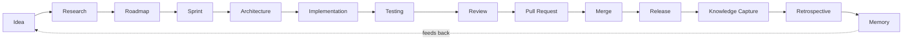

# WORKFLOW.md — End-to-End Lifecycle

| Field | Value |
|---|---|
| Document type | Operational workflow (new capability) |
| Status | Active |
| Version | 1.1.0 |
| Layered on | `.ai/DECISION_PROCESS.md`, `PROTOCOL.md`, `.orion/TEAM.md` |
| Does not replace | `CONTRIBUTING.md`, `.ai/DECISION_PROCESS.md` |

## Purpose

`CONTRIBUTING.md` and `.ai/DECISION_PROCESS.md` already define how a single change moves from an approved Issue to a merge. This document places that flow inside a wider lifecycle — from a raw idea to the knowledge that outlives the change — so nothing produced along the way is lost, and every stage has a clear owner by role (resolved via `.orion/TEAM.md`).

No new artifact types are introduced. Every stage below produces or consumes an artifact already defined elsewhere in this repository: a GitHub Issue, an ADR in `docs/DECISIONS.md`, a Pull Request, a Handoff Record, or an update to a living document (`README.md`, `docs/ARCHITECTURE.md`).

---

## 1. Idea

**Purpose.** Capture a need, problem, or opportunity before it is evaluated.
**Owning role.** Any role originates; Product Owner receives.
**Artifact.** A GitHub Issue opened in draft/needs-triage state, or a note attached to an existing one.
**Exit criteria.** The idea is written down somewhere durable — an open Issue — even before it is approved.

## 2. Research

**Purpose.** Establish facts, constraints, and options before committing resources.
**Owning role.** Research (currently unassigned in `.orion/TEAM.md`; performed ad hoc by CTO or Architect until a dedicated implementation exists).
**Artifact.** Findings captured as comments on the Issue, or folded into the Context section of the ADR the Issue will produce.
**Exit criteria.** Open questions material to prioritization or design are answered, or explicitly left open with a stated reason.

## 3. Roadmap

**Purpose.** Decide whether, and when, the idea gets built relative to everything else in flight.
**Owning role.** Product Owner.
**Artifact.** The Issue is labeled/prioritized and approved, per `CONTRIBUTING.md` ("All implementation work begins with an approved GitHub Issue").
**Exit criteria.** The Issue is approved by Luis, or explicitly closed as rejected/deferred with a reason.

## 4. Sprint

**Purpose.** Group a bounded set of approved Issues into a working period.
**Owning role.** Product Owner plans; all roles execute within it.
**Artifact.** No new artifact type — a milestone or equivalent grouping of approved Issues.
**Exit criteria.** Scope for the period is fixed; every included Issue has an owning Builder assigned via `.orion/TEAM.md`.

## 5. Architecture

**Purpose.** Decide how an approved Issue will be built before anyone builds it, when the change is cross-cutting or hard to reverse.
**Owning role.** Architect (software structure) and/or CTO (strategic/AI design), per `.ai/ROLES.md`.
**Artifact.** An ADR in `docs/DECISIONS.md`, following the Architecture or Governance path in `.ai/DECISION_PROCESS.md`. Purely local, reversible implementation choices skip this stage by design.
**Exit criteria.** The ADR is Accepted (Author, Reviewed by, Approved by all present), or the Issue is judged local/reversible and proceeds straight to Implementation. Either way, when the work proceeds to Builder execution, an Approved Mission also exists in [`.orion/missions/`](.orion/missions/README.md), scoping exactly what the Builder may create or modify.

## 6. Implementation

**Purpose.** Build the approved Issue or ADR.
**Owning role.** Builder.
**Artifact.** Code and tests on a branch, referencing the Issue, the Mission ([`.orion/missions/`](.orion/missions/README.md)), and, where one exists, the ADR.
**Exit criteria.** The implementation is functionally complete against the Issue's acceptance criteria and ready for review.

## 7. Testing

**Purpose.** Produce evidence the implementation behaves as intended, proportional to risk.
**Owning role.** Builder writes tests; Reviewer assesses adequacy.
**Artifact.** Automated tests attached to the Pull Request; results visible in CI once CI exists (see `docs/ARCHITECTURE.md` status).
**Exit criteria.** Tests pass and their coverage is judged proportional to risk by the Reviewer.

## 8. Review

**Purpose.** Independently verify the work against the Definition of Done and Quality Standards in `.ai/DECISION_PROCESS.md`.
**Owning role.** Reviewer — never the Builder who authored the change.
**Artifact.** Review comments on the Pull Request; approval or change request per `.github/PULL_REQUEST_TEMPLATE.md`.
**Exit criteria.** Reviewer approval is recorded on the Pull Request.

## 9. Pull Request

**Purpose.** Package the reviewed change into a single mergeable, revertible unit.
**Owning role.** Builder opens it; Reviewer signs off; GitOps verifies mechanics.
**Artifact.** The Pull Request itself, using `.github/PULL_REQUEST_TEMPLATE.md`, referencing its Issue and any ADR.
**Exit criteria.** The Pull Request builds cleanly against the current trunk, has no unresolved conflicts, and carries Reviewer approval.

## 10. Merge

**Purpose.** Integrate the change into the trunk.
**Owning role.** GitOps.
**Artifact.** A merge commit, with the Pull Request and its referenced Issue/ADR preserved in history.
**Exit criteria.** Final approval by Luis is recorded, per every governance path in `.ai/DECISION_PROCESS.md`, and the merge is confirmed revertible as a single unit.

## 11. Release

**Purpose.** Make merged changes available, on criteria Product Owner and CTO/Architect define.
**Owning role.** GitOps executes; Product Owner and Architect set criteria.
**Artifact.** A tagged release (once the project reaches a stage where releases are cut; currently pre-alpha per `README.md`).
**Exit criteria.** Release criteria are met and documented.

## 12. Knowledge Capture

**Purpose.** Ensure what was learned or decided is not lost once the Pull Request closes.
**Owning role.** Documentation (currently absorbed by Architect in `.orion/TEAM.md`).
**Artifact.** Updates to `docs/ARCHITECTURE.md`, `README.md`, or any other living document affected by the change — required by the Definition of Done in `.ai/DECISION_PROCESS.md`.
**Exit criteria.** No drift between living documents and the merged system.

## 13. Retrospective

**Purpose.** Evaluate how the work went, independent of what was delivered.
**Owning role.** Documentation facilitates; all roles contribute.
**Artifact.** A Retrospective Note filed as a comment on the closing Issue or Pull Request. If it produces a proposed process change, that change is filed as a new ADR in `docs/DECISIONS.md` following the Architecture or Governance path.
**Exit criteria.** The Retrospective Note exists; any proposed process change is routed as a new Issue (idea) or ADR (governance amendment).

## 14. Memory

**Purpose.** Make everything produced across the lifecycle discoverable by future work.
**Owning role.** Documentation maintains; all roles consume.
**Artifact.** No new artifact — the accumulated, cross-referenced body of Issues, Pull Requests, ADRs, and living documents already produced by stages 1–13.
**Exit criteria.** No decision, design, or lesson relevant to future work exists only inside an agent's session context. If it mattered, it is in the repository.

---

## Proportionality

| Risk level | Research | Architecture | Testing | Review depth |
|---|---|---|---|---|
| Local, reversible | Optional | Skipped (no ADR) | Unit tests | Standard review |
| Cross-cutting, reversible | Targeted | ADR required | Unit + integration | Full checklist review |
| Hard to reverse | Full | ADR + Luis ratification | Unit + integration + rollback check | Full checklist review, escalation-aware |

This mirrors the governance-path classification already implicit in `.ai/DECISION_PROCESS.md`'s three paths; it does not introduce a new classification scheme.

---

## Amendment log

| Version | Date | Change | Approved by |
|---|---|---|---|
| 1.0.0 | 2026-07-17 | Initial workflow, layered on existing governance paths and artifacts | Luis Aguirre |
| 1.1.0 | 2026-07-17 | Stages 5 and 6 now require an Approved Mission before Builder execution. Part of MISSION-0001 (ADR-0005). | Luis Aguirre |
