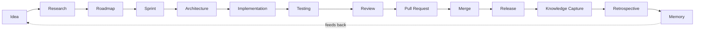

# WORKFLOW.md — End-to-End Lifecycle

| Field | Value |
|---|---|
| Document type | Governance |
| Status | Active |
| Version | 1.0.0 |
| Owner | Board |
| Derives authority from | `ORION.md`, `ROLES.md`, `PROTOCOL.md` |

## Overview

Every unit of work in ORION OS passes through the same fourteen stages, in order, regardless of its size. Small work moves through the stages quickly, with lightweight documents; large or risky work moves through the same stages with more rigorous ones. No stage is optional, but the depth of each stage is proportional to risk — this proportionality is itself a decision the Product Owner and Architect make explicitly at Roadmap and Architecture time, not an excuse to skip a stage silently.

Each stage below is described as: **Purpose**, **Primary role(s)**, **Inputs**, **Outputs**, **Exit criteria**.

---

## 1. Idea

**Purpose.** Capture a need, problem, or opportunity before it is evaluated or committed to.

**Primary role(s).** Any role may originate an idea; Product Owner receives it.

**Inputs.** Any observation: a defect, a user need, a strategic opportunity, a finding from a prior Retrospective.

**Outputs.** A Work Request (`PROTOCOL.md` §1), even if minimal.

**Exit criteria.** The idea exists as a committed Work Request with a problem statement. It does not yet need a solution.

## 2. Research

**Purpose.** Establish the facts, constraints, and options before committing resources.

**Primary role(s).** Research Agent, on request from Product Owner or Architect. Skippable only when the Work Request is unambiguous and low risk — that skip decision is recorded, not silent.

**Inputs.** The Work Request; specific open questions it raises.

**Outputs.** A Research Report (`PROTOCOL.md` §1).

**Exit criteria.** Open questions material to prioritization or design are answered or explicitly labeled unresolved with a recommended next step.

## 3. Roadmap

**Purpose.** Decide whether, and when, the idea gets built, relative to everything else competing for capacity.

**Primary role(s).** Product Owner.

**Inputs.** Work Request, Research Report (if produced).

**Outputs.** An entry in `roadmap/ROADMAP.md` with priority and acceptance criteria, or an explicit rejection recorded on the Work Request.

**Exit criteria.** The item has a place in the roadmap with acceptance criteria clear enough for an Architect to design against, or it is closed as rejected/deferred with a reason.

## 4. Sprint

**Purpose.** Commit a bounded set of roadmap items to a time-boxed delivery window.

**Primary role(s).** Product Owner (plans and chairs), all roles (execute within it).

**Inputs.** Prioritized roadmap items ready for design or implementation.

**Outputs.** A Sprint Plan: scope, assigned roles, exit criteria for the sprint.

**Exit criteria.** Scope is fixed and every item in it has an owning role assigned, per `ROLES.md` and `.ai/ROLES.md`.

## 5. Architecture

**Purpose.** Decide how a roadmap item will be built before anyone builds it.

**Primary role(s).** Architect (authors), Reviewer (sign-off on structural fit for cross-cutting items).

**Inputs.** Roadmap item and its acceptance criteria; current `docs/ARCHITECTURE.md`.

**Outputs.** A Design Document, and an ADR for anything classified cross-cutting or hard-to-reverse per `ORION.md` §5.

**Exit criteria.** The Design Document is `approved` per the state machine in `PROTOCOL.md` §6, and — where required — the ADR is Board-ratified.

## 6. Implementation

**Purpose.** Build the approved design.

**Primary role(s).** Builder.

**Inputs.** Approved Design Document or ADR.

**Outputs.** Code and an Implementation Report describing how the result maps to the design, including any documented deviations.

**Exit criteria.** The implementation is functionally complete against the acceptance criteria and ready for tests to be written or finalized.

## 7. Testing

**Purpose.** Produce evidence that the implementation behaves as designed, proportional to its risk.

**Primary role(s).** Builder (writes tests), Reviewer (assesses adequacy).

**Inputs.** Implementation and its acceptance criteria.

**Outputs.** A Test Report: what was tested, at what level (unit, integration, end-to-end, manual where unavoidable), and the results.

**Exit criteria.** All tests pass, and their coverage is judged proportional to risk by the Reviewer — quantity of tests is not itself the criterion.

## 8. Review

**Purpose.** Independently verify the work against the Definition of Done and Quality Standards before it can move toward the codebase's trunk.

**Primary role(s).** Reviewer.

**Inputs.** Implementation Report, Test Report, the Design Document/ADR they claim to satisfy.

**Outputs.** A Review Report: approve, request changes, or reject, with findings tied to specific standards.

**Exit criteria.** Review Report status is `approved`. `changes_requested` returns the unit of work to Implementation; `rejected` returns it to Architecture or Roadmap depending on the reason.

## 9. Pull Request

**Purpose.** Package the approved change into a single, mergeable, revertible unit.

**Primary role(s).** Builder (opens it), Reviewer (attaches Review Report), GitOps (verifies mechanics).

**Inputs.** Approved Implementation Report, Test Report, Review Report.

**Outputs.** A Pull Request referencing all of the above documents by id.

**Exit criteria.** The Pull Request builds cleanly against current `main`, has no unresolved conflicts, and carries an `approved` Review Report.

## 10. Merge

**Purpose.** Physically integrate the change into the trunk.

**Primary role(s).** GitOps.

**Inputs.** A Pull Request meeting the exit criteria of stage 9.

**Outputs.** A merge commit, with the Pull Request and its referenced documents preserved in history.

**Exit criteria.** The merge is clean, `main` builds, and the change is confirmed revertible as a single unit (`ORION.md` §3, Reversibility).

## 11. Release

**Purpose.** Make merged changes available, on a cadence and criteria the Product Owner and Architect define.

**Primary role(s).** GitOps (executes), Product Owner and Architect (set release criteria).

**Inputs.** A set of merged changes meeting the release criteria.

**Outputs.** A tagged release and generated release notes summarizing what shipped, traceable back to the originating Work Requests.

**Exit criteria.** The release is tagged, notes are published, and the Definition of Done (`ORION.md` §6) is satisfied for every included unit of work.

## 12. Knowledge Capture

**Purpose.** Ensure what was learned or decided during delivery is not lost once the Pull Request closes.

**Primary role(s).** Documentation Agent.

**Inputs.** All documents produced across stages 1–11 for the unit(s) of work released.

**Outputs.** Updates to `docs/ARCHITECTURE.md` and any other living document affected; a durable link from the release to its originating decisions.

**Exit criteria.** No drift exists between living documents and the released system, verified per `ROLES.md` (Documentation Agent success metrics).

## 13. Retrospective

**Purpose.** Evaluate how the sprint or release went, independent of what was delivered.

**Primary role(s).** Documentation Agent (facilitates and records), all roles (contribute).

**Inputs.** Sprint Plan and its exit criteria; incidents, escalations, and rework observed during the sprint.

**Outputs.** A Retrospective Record under `docs/retrospectives/`, including concrete process changes proposed, if any.

**Exit criteria.** The Retrospective Record is committed, and any proposed process change is routed as a new Work Request (closing the loop back to stage 1) or as a governance amendment per `ORION.md` §5.

## 14. Memory

**Purpose.** Make everything produced across the lifecycle discoverable and reusable by future work, rather than requiring it to be rediscovered.

**Primary role(s).** Documentation Agent (maintains the index), all roles (consume it).

**Inputs.** Every document produced in stages 1–13.

**Outputs.** An indexed, cross-linked body of documents in the repository — Work Requests, Design Documents, ADRs, Review Reports, Retrospective Records — that any agent, including one new to the project, can read cold to understand both the current state and how it got there.

**Exit criteria.** No decision, design, or lesson relevant to future work exists only in an agent's transient context. If it mattered, it is in the repository.

---

## Proportionality guidance

| Risk level | Research | Architecture | Testing | Review depth |
|---|---|---|---|---|
| Low (local, reversible) | Optional, noted as skipped | Inline note, no separate DD | Unit tests | Single-pass review |
| Medium (cross-cutting, reversible) | Targeted Research Report | Design Document | Unit + integration | Full checklist review |
| High (hard to reverse) | Full Research Report | Design Document + ADR + Board ratification | Unit + integration + explicit rollback test | Full checklist review + Board awareness |

This table operationalizes the decision classes defined in `ORION.md` §5. The Architect assigns the risk level at stage 5; a Reviewer or the Board may challenge that assignment through the standard escalation path in `PROTOCOL.md` §8.

---

## Amendment log

| Version | Date | Change | Approved by |
|---|---|---|---|
| 1.0.0 | 2026-07-17 | Initial workflow definition | Board |
